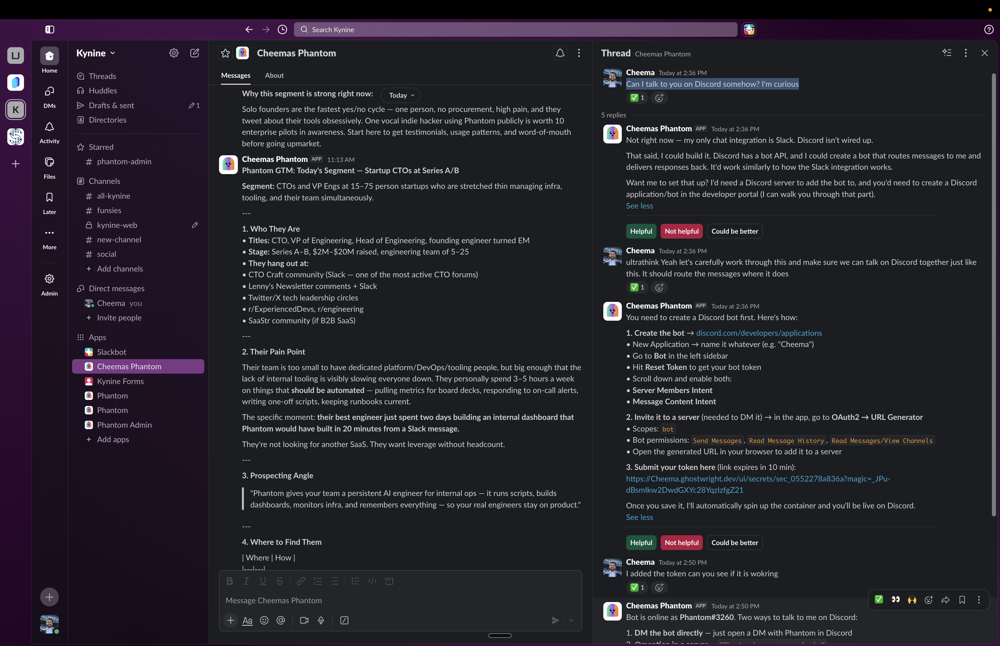

<p align="center">
  
</p>

<h1 align="center">Phantom</h1>
<p align="center">An AI co-worker with its own computer.</p>

<p align="center">
  <a href="LICENSE"></a>
  
  <a href="https://hub.docker.com/r/ghostwright/phantom"></a>
  
</p>

<p align="center">
  <a href="https://ghostwright.dev/phantom">Website</a> &middot;
  <a href="https://ghostwright.dev/phantom">Get a Free Phantom</a> &middot;
  <a href="docs/">Docs</a> &middot;
  <a href="https://github.com/ghostwright/phantom/issues">Issues</a>
</p>

---

## The Idea

AI agents today are disposable. You open a chat, get an answer, close the tab, and the context is gone. Next time you start from scratch. Every session is day one.

Phantom takes a different approach: **give the AI its own computer.** A dedicated machine where it installs software, spins up databases, builds dashboards, remembers what you told it last week, and gets measurably better at your job every day. Your laptop stays yours. The agent's workspace is its own.

This is not a chatbot. It is a co-worker that runs on Slack, has its own email address, creates its own tools, and builds infrastructure without asking for permission. Don't take our word for it - scroll down to see what production Phantoms have actually built.

## What This Actually Looks Like

These are not mockups. They happened on production Phantom instances.

### Built an analytics platform from scratch

A Phantom was asked to help with data analysis. It installed ClickHouse on its own VM, downloaded the full Hacker News dataset, loaded 28.7 million rows spanning 2007-2021, built an analytics dashboard with interactive charts, and created a REST API to query the data. Then it registered that API as an MCP tool so it could use it in future sessions and other agents could query it too.

Nobody asked it to build any of this. It identified analytics as useful and built the entire stack.

<p align="center">
  
</p>

*28.7 million items. 755K unique authors. 4.3 million stories. Built, loaded, and served by a Phantom on its own machine.*

### Extended itself with a channel it was never built with

Phantom ships with Slack, Telegram, Email, and Webhook channels. It does not ship with Discord. When asked "Can I talk to you on Discord?", the Phantom said: "Not right now. Discord isn't wired up. That said, I could build it."

It explained the Discord Bot API, walked the user through creating a Discord application, provided a magic link for secure token submission, and said: "Once you save it, I'll automatically spin up the container and you'll be live on Discord."

After submitting the token, Phantom went live on Discord. It permanently gained a communication channel it was never designed with.

<p align="center">
  
</p>

*The agent was honest about what it could not do, then built the capability on the spot.*

### Started monitoring its own infrastructure

A Phantom discovered [Vigil](https://github.com/baudsmithstudios/vigil), a lightweight open-source system monitor with 3 GitHub stars. It understood what Vigil does, integrated it into its existing ClickHouse instance, built a sync pipeline that batch-transfers metrics every 30 seconds, and created a real-time monitoring dashboard showing service health, Docker container status, network I/O, disk I/O, system load, and data pipeline health.

890,450 rows. 25 metrics. Auto-refreshing. The agent is watching its own infrastructure.

<p align="center">
  
</p>

*It found a 3-star open-source project, integrated it into its data pipeline, and built observability for itself.*

---

This is what happens when you give an AI its own computer.

## Quick Start

### Docker (recommended)

```bash
curl -fsSL https://raw.githubusercontent.com/ghostwright/phantom/main/docker-compose.user.yaml -o docker-compose.yaml
curl -fsSL https://raw.githubusercontent.com/ghostwright/phantom/main/.env.example -o .env
# Edit .env - add your ANTHROPIC_API_KEY, Slack tokens, and OWNER_SLACK_USER_ID
docker compose up -d
```

Your Phantom is running. Qdrant starts for memory, Ollama pulls the embedding model, and the agent boots. Check health at `http://localhost:3100/health`. With Slack configured, it DMs you when it's ready. Add `RESEND_API_KEY` for email sending. See [Getting Started](docs/getting-started.md) for full setup.

> **Security note — Docker socket mount:** `docker-compose.yaml` mounts
> `/var/run/docker.sock` into the Phantom container so it can spawn sibling
> containers (e.g. sandboxed code execution). This is an intentional
> architectural trade-off: the socket grants the container **root-equivalent
> access to the Docker daemon**, which means a compromised Phantom process
> could create, modify, or destroy any container on the host. Mitigations:
> run Phantom on a dedicated machine or VM (not your personal workstation),
> and do not expose the host's Docker socket to untrusted workloads. See
> [docs/security.md](docs/security.md) for the full threat model.


### Managed (free)

Get a Phantom on a dedicated VM with nothing to install. Bring your Anthropic API key, we give you the machine.

**[ghostwright.dev/phantom](https://ghostwright.dev/phantom)**

## What People Build with Phantom

Phantom is not just for engineers. It is for anyone who wants an AI that remembers, learns, and builds things you can actually share.

**The key difference:** when an AI runs on your laptop, everything it builds is trapped on localhost. Only you can see it. Phantom runs on a VM with a public domain. Dashboards, tools, pages, APIs - they all get a URL you can send to your team, your manager, or your clients. Your laptop is not a server. Phantom's VM is.

### For People Who Don't Write Code

You don't need to install developer tools, learn a build system, or figure out hosting. You describe what you want in Slack. Phantom builds it, deploys it on its own machine, and gives you a link.

- **"Build me a Chrome extension that highlights overdue emails."** Phantom builds it and gives you a zip file. You drag it into Chrome. No Xcode, no npm, no terminal. Just install it and go.
- **"Make a landing page for my side project."** Phantom builds the page, serves it on its public domain, and gives you a URL. Send it to anyone. No hosting setup, no domain configuration.
- **"Create a weekly report of our open support tickets."** Phantom builds the automation, runs it on a schedule, and emails you the summary every Friday from its own email address.
- **"Build a form where the team can submit feature requests."** Phantom creates it on its domain, handles submissions, and routes them to Slack.

### Software Engineering

- **Morning standup:** "Every weekday at 9am, summarize open PRs, CI status, and what needs review." Phantom checks GitHub, compiles the summary, and posts it to your team channel.
- **Codebase onboarding:** "Clone this repo and give me an architecture overview." Phantom reads the code and returns specifics, not generics. "Next.js 16 with App Router, Drizzle ORM on Neon Postgres, flaky step in the migration check."
- **Infrastructure:** "Set up a dev Postgres for this project." Phantom spins up a Docker container on its own machine, creates the schema, runs migrations, and gives you a connection string. Nothing installed on your laptop.
- **Data pipelines:** "Pull from our API every hour and load into Postgres." Phantom builds the pipeline, runs the database on its VM, and schedules the cron. You get a connection string.
- **Custom MCP tools:** "Create an MCP tool that queries our internal API." Phantom builds the tool, registers it, and any Claude Code instance connected to it can call it immediately.

### Sales and Account Management

- **Prospect research:** "Research these 10 companies and build outreach strategies." Phantom gathers intelligence, identifies decision-makers, and creates briefing pages you can share with your team.
- **Recruiting profiles:** "Make a profile page for this candidate." Phantom researches the person and builds a public profile page you can send to hiring managers. Shareable URL with auth.
- **Competitor monitoring:** "Every 2 minutes, check for open-source repos similar to our product." Phantom runs a cron job, tracks new entrants, and posts updates to Slack.

### Data and Analytics

- **Build your own analytics stack:** Phantom installs databases, builds ETL pipelines, and registers APIs as MCP tools for future sessions. All on its own machine. (See the ClickHouse story above.)
- **Shareable dashboards:** "Track our PR velocity and show it to the team." Phantom builds an ECharts dashboard, serves it on a public URL with auth, and sends you the link. Your team bookmarks it. They see the same thing you see.
- **Data exploration:** "Load this dataset and let me ask questions about it." Phantom creates a queryable environment on its VM. You ask in plain English, it translates to SQL.

### Operations, Marketing, and Everyone Else

- **Automated reports:** "Email a weekly summary of open issues to team leads every Friday." Phantom compiles the report and sends it from its own email address.
- **Competitor watching:** "Monitor these five websites for changes and tell me when something updates." Phantom checks on a schedule and notifies you in Slack.
- **Blog drafts:** "Write a post based on our recent product updates." Phantom reads the changelog, writes the draft, and serves it as a page you can review and share with your editor.
- **Personal coaching:** "Create a training plan for me." Phantom builds a complete plan with a coach persona, served as a page you can reference daily.

### For Everyone

- Remembers what you told it last Monday and uses it on Wednesday.
- Never asks the same question twice.
- Gets measurably better at YOUR job every day, not just at being a generic assistant.

## How It's Different

Most AI assistants run on your computer, share your resources, and forget everything between sessions. Phantom was designed around a different assumption: the agent should have its own workspace.

| | Traditional (runs on your machine) | Phantom (its own machine) |
|--------|-----------------------------------|--------------------------|
| **Your computer** | Shared with the agent | Yours alone |
| **Security** | Agent can access your full filesystem | Isolated VM, you control what it sees |
| **Credentials** | Often stored in plain text config files | AES-256-GCM encrypted, collected via secure forms |
| **Sharing** | Trapped on localhost, nobody else can see it | Public URL with auth, share with anyone |
| **Tools** | Fixed set, defined at install time | Creates its own tools at runtime, persists them across restarts |
| **Availability** | Only when your machine is on | 24/7, runs in the cloud |
| **Cost** | Uses your CPU and memory | $7-20/month for a dedicated VM |

## Why This Matters

**"Why does it need its own computer?"**

Because you can have an 8GB laptop and give your agent 64GB of RAM for $20/month. Because it can install software, spin up databases, and run services without touching your machine. Because it is always on, even when your laptop is closed. Because everything it builds has a public URL - dashboards, APIs, pages, tools - that you share with a link. Your laptop cannot do that. It does not have a public IP. Phantom's VM does.

**"Why does self-evolution matter?"**

Because Day 1 Phantom is generic. Day 30 Phantom knows your codebase, your deploy process, your PR conventions, and the fact that your biggest client always asks about uptime before renewal. You never repeat yourself. The agent observes, reflects, proposes changes, validates them through a different model (to avoid self-enhancement bias), and evolves. Every version is stored. You can roll back.

**"Why do dynamic tools matter?"**

Because the agent that can only use pre-built tools hits a ceiling. Phantom builds what it needs. One Phantom built a `send_slack_message` tool, registered it, and retired its old workaround. That tool survives restarts. Other agents connecting via MCP can use it too.

## Features

| Feature | Why it matters |
|---------|----------------|
| **Its own computer** | Your laptop stays yours. The agent installs software, runs 24/7, and builds infrastructure on its own machine. |
| **Self-evolution** | The agent rewrites its own config after every session, validated by LLM judges. Day 30 knows things Day 1 didn't. |
| **Persistent memory** | Three tiers of vector memory. Mention something on Monday, it uses it on Wednesday. No re-explaining. |
| **Dynamic tools** | Creates and registers its own MCP tools at runtime. Tools survive restarts and work across sessions. |
| **Encrypted secrets** | AES-256-GCM encrypted forms with magic-link auth. No plain-text credentials in config files. |
| **Email identity** | Every Phantom has its own email address. Send reports to people outside your Slack workspace. |
| **Shareable pages** | Generates dashboards and tools on a public URL with auth. Share a link, anyone can see it. |
| **MCP server** | Claude Code connects to your Phantom. Other Phantoms connect to your Phantom. It is an API, not a dead end. |

## Architecture

<div align="center">

```
            External Clients
  Claude Code | Dashboard | Other Phantoms
                    |
          MCP (Streamable HTTP)
                    |
+------------------------------------------+
|        PHANTOM (Bun process)             |
|                                          |
|  Channels       Agent Runtime            |
|  Slack          query() + hooks          |
|  Telegram       Prompt Assembler         |
|  Email          base + role + evolved    |
|  Webhook        + memory context         |
|  CLI                                     |
|                                          |
|  Memory System  Self-Evolution Engine    |
|  Qdrant         6-step pipeline          |
|  Ollama         5-gate validation        |
|  3 collections  LLM judges (optional)    |
|                                          |
|  MCP Server     Role System              |
|  8 universal    YAML-first roles         |
|  + role tools   Onboarding flow          |
|  + dynamic      Evolution focus          |
+------------------------------------------+
            |                |
       +---------+      +---------+
       | Qdrant  |      | SQLite  |
       | Docker  |      |   Bun   |
       +---------+      +---------+
```

</div>

## Connect from Claude

First, generate a token. The command outputs a bearer token — save it for the next step.

**Bare metal:**
```bash
bun run phantom token create --client claude-code --scope operator
```

**Docker:**
```bash
docker exec phantom bun run phantom token create --client claude-code --scope operator
```

**Or just ask your Phantom in Slack:** "Create an MCP token for Claude Code." It will generate the token and give you the config snippet.

Then use the token to connect. Replace `YOUR_TOKEN` below with the token from the command above. For local instances, use `http://localhost:3100/mcp` instead of the `ghostwright.dev` URL.

### Claude Code (CLI)

Add via the CLI:

```bash
claude mcp add phantom https://your-phantom.ghostwright.dev/mcp \
  --transport http \
  --header "Authorization: Bearer YOUR_TOKEN"
```

Or add directly to your project's `.mcp.json`:

```json
{
  "mcpServers": {
    "phantom": {
      "type": "http",
      "url": "https://your-phantom.ghostwright.dev/mcp",
      "headers": {
        "Authorization": "Bearer YOUR_TOKEN"
      }
    }
  }
}
```

### Claude Desktop

Claude Desktop only supports stdio transport, so you need [`mcp-remote`](https://www.npmjs.com/package/mcp-remote) to bridge the connection.

Add this to your `claude_desktop_config.json` (Settings → Developer → Edit Config):

```json
{
  "mcpServers": {
    "phantom": {
      "command": "npx",
      "args": [
        "mcp-remote",
        "https://your-phantom.ghostwright.dev/mcp",
        "--header",
        "Authorization: Bearer YOUR_TOKEN"
      ]
    }
  }
}
```

Restart Claude Desktop after saving. The first connection may take a moment while `mcp-remote` is downloaded.

### Verify

Once connected, Claude can query your Phantom's memory, ask it questions, check status, and use any dynamic tools the agent has built.

## Self-Evolution

The core differentiator. After every session:

1. **Observe** - extract corrections, preferences, and domain facts from the conversation
2. **Critique** - compare session performance against current config
3. **Generate** - propose minimal, targeted config changes
4. **Validate** - 5 gates: constitution, regression, size, drift, safety
5. **Apply** - write approved changes, bump version
6. **Consolidate** - periodically compress observations into principles

Safety-critical gates use Sonnet 4.6 as a cross-model judge. Triple-judge voting with minority veto: one dissenting judge blocks the change. Every version is stored. You can diff day 1 and day 30. You can roll back.

## The Ghostwright Ecosystem

Phantom is the fourth product in the Ghostwright family:

- **[Ghost OS](https://github.com/ghostwright/ghost-os)** - MCP server for macOS accessibility and screen perception
- **[Shadow](https://github.com/ghostwright/shadow)** - ambient capture and recall for Mac
- **[Specter](https://github.com/ghostwright/specter)** - VM provisioning on Hetzner with DNS, TLS, and systemd
- **Phantom** - the autonomous co-worker

<details>
<summary><strong>Development Setup</strong></summary>

```bash
git clone https://github.com/ghostwright/phantom.git
cd phantom
bun install

# Start vector DB and embedding model
docker compose up -d qdrant ollama
docker exec phantom-ollama ollama pull nomic-embed-text

# Initialize config
bun run phantom init --yes

# Set your API key
export ANTHROPIC_API_KEY=sk-ant-...

# Start
bun run phantom start
```

```bash
bun test              # 770 tests
bun run lint          # Biome
bun run typecheck     # tsc --noEmit
```

See [docs/getting-started.md](docs/getting-started.md) for detailed Slack setup, .env configuration, VM deployment, and troubleshooting.

</details>

## Contributing

We need help with new role templates, channel integrations, memory strategies, and testing across environments. If you are building AI agents that learn and improve, this is the project.

See [CONTRIBUTING.md](CONTRIBUTING.md) for guidelines.

## License

Apache 2.0. Use it, modify it, deploy it, build on it. See [LICENSE](LICENSE).
